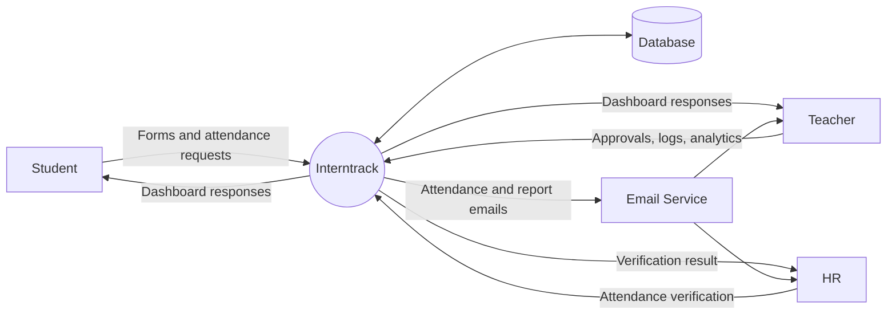
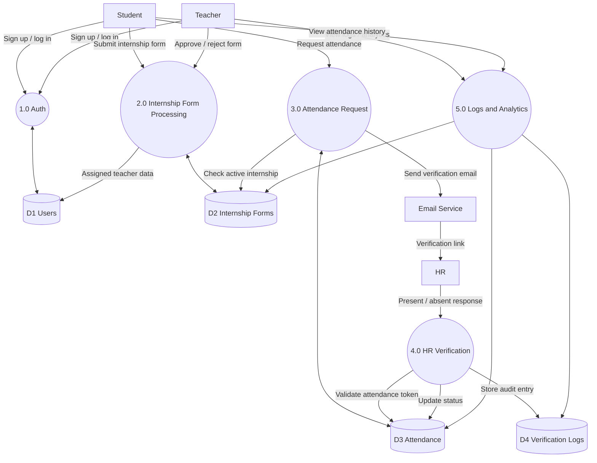

# Interntrack

Interntrack is a full-stack internship management platform for colleges. It lets students submit internship details, enables teachers to review and approve them, tracks daily attendance through HR email verification, and keeps an audit trail of verification activity.

The current app is built with Next.js App Router, Prisma, PostgreSQL, JWT cookie auth, Tailwind CSS, and shadcn/ui.

## What It Does

### Student experience
- Sign up and log in as a student
- Submit an internship form with company, duration, stipend, mode, offer letter URL, HR email, and department coordinator email
- View approval status, rejection reasons, and internship history
- Request daily attendance verification for the active internship
- Track attendance through calendar and heatmap style views

### Teacher experience
- Sign up and log in as a teacher
- Review pending internship forms
- Approve or reject submissions with a required rejection reason
- View student and attendance activity from the dashboard
- Manage department coordinators by branch
- Review audit logs for attendance verification events
- Access analytics dashboards for placements, companies, stipend trends, attendance rate, and exports
- Send or receive periodic attendance report emails

### HR verification flow
- No login is required for HR
- A student requests attendance for the active internship
- Interntrack emails HR a verification link with `present` and `absent` actions
- The link updates attendance status and stores verification metadata such as IP address and user agent

## Data Flow Diagrams

### High-Level DFD



### Low-Level DFD



At a glance:

- The high-level DFD shows the main users, the app, the database, and email delivery.
- The low-level DFD shows the main internal processes, data stores, and how attendance verification moves through the system.

## Tech Stack

- Next.js 13.5 App Router
- React 18
- TypeScript
- Prisma ORM
- PostgreSQL
- JWT authentication via cookies
- Nodemailer for SMTP email delivery
- Tailwind CSS + shadcn/ui
- Recharts for analytics visualizations

## Core Data Model

The main Prisma models are:

- `User`: students and teachers
- `InternshipForm`: internship application and approval state
- `Attendance`: one attendance request per day per internship
- `VerificationLog`: audit log for HR verification actions
- `DepartmentCoordinator`: branch-wise coordinator directory

Current internship statuses:

- `PENDING`
- `APPROVED`
- `COMPLETED`
- `REJECTED`

Current attendance statuses:

- `PENDING`
- `VERIFIED`
- `ABSENT`

## Project Structure

```text
app/
  api/                  API routes for auth, forms, attendance, analytics, cron jobs
  student/              Student auth and dashboard pages
  teacher/              Teacher auth, dashboard, and analytics pages
components/
  student/              Student dashboard and form UI
  teacher/              Teacher dashboard, logs, coordinator management UI
  ui/                   Shared shadcn/ui components
lib/
  auth.ts               JWT, password hashing, auth helpers
  email.ts              Attendance and report email helpers
  prisma.ts             Prisma client singleton
prisma/
  schema.prisma         Database schema
  migrations/           Prisma migrations
middleware.ts           Route protection for dashboard pages
vercel.json             Vercel cron configuration
```

## Getting Started

### 1. Install dependencies

`pnpm` is the preferred package manager in this repo.

```bash
pnpm install
```

If you use `npm`, keep to `npm` consistently for install and scripts.

### 2. Create environment variables

```bash
cp .env.example .env
```

Then update the values for your local database, JWT secret, SMTP provider, and base URL.

### 3. Run database migrations

```bash
pnpm prisma generate
pnpm prisma migrate dev
```

### 4. Start the app

```bash
pnpm dev
```

Open:

- `http://localhost:3000`
- Student login: `http://localhost:3000/student/login`
- Teacher login: `http://localhost:3000/teacher/login`

## Environment Variables

| Variable | Required | Purpose |
| --- | --- | --- |
| `DATABASE_URL` | Yes | PostgreSQL connection used by Prisma |
| `JWT_SECRET` | Yes | Signs and verifies auth and attendance tokens |
| `SMTP_HOST` | Recommended | SMTP host for attendance and report emails |
| `SMTP_PORT` | Recommended | SMTP port |
| `SMTP_USER` | Recommended | SMTP username |
| `SMTP_PASS` | Recommended | SMTP password |
| `NEXT_PUBLIC_BASE_URL` | Recommended | Base URL used in attendance verification links |
| `CRON_SECRET` | Required in production | Protects scheduled job endpoints |
| `NEXT_PUBLIC_ENABLE_REPORTS` | Optional | Toggles teacher report visibility in the dashboard |

## Development Notes

### Development shortcut login

In `development`, both login routes accept:

- Email: `admin`
- Password: `admin123`

That shortcut works for:

- `/api/auth/login/student` as a temporary student user
- `/api/auth/login/teacher` as a temporary teacher user

### Email behavior

Attendance requests create an attendance record and then send an HR verification email. If SMTP variables are missing, email delivery is skipped and the request will fail.

### Location logging

IP capture is implemented, but the geolocation helper is still a placeholder. Verification logs currently store derived values like `Location for <ip>` unless you wire in a real lookup provider in [`lib/utils/ip.ts`](/home/rushabh/Dev/Interntrack/lib/utils/ip.ts).

## Scheduled Jobs

`vercel.json` currently defines three cron jobs:

- `/api/scheduled/attendanceReports` at `30 3 1,16 * *`
- `/api/scheduled/completed-internships` at `0 2 */2 * *`
- `/api/scheduled/active-internships` at `0 2 */2 * *`

What they do:

- `attendanceReports`: emails a CSV report of the last 15 days of verification activity to all teachers
- `completed-internships`: marks expired active internships as `COMPLETED`
- `active-internships`: activates approved internships whose date range has started

In production, these routes expect `Authorization: Bearer <CRON_SECRET>` or the matching cron secret header where implemented.

## Main Routes

### Pages

- `/`
- `/student/signup`
- `/student/login`
- `/student/dashboard`
- `/teacher/signup`
- `/teacher/login`
- `/teacher/dashboard`
- `/teacher/analytics`

### API

Authentication:

- `POST /api/auth/signup`
- `POST /api/auth/login/student`
- `POST /api/auth/login/teacher`
- `POST /api/auth/logout`
- `GET /api/auth/me`

Internships and attendance:

- `POST /api/internship-form`
- `GET /api/internship-form`
- `PATCH /api/internship-form/[id]/approve`
- `POST /api/attendance/request`
- `GET /api/attendance/verify`

Teacher/admin data:

- `GET /api/users/teachers`
- `GET /api/logs`
- `GET /api/analytics`
- `GET /api/dept-coordinator`
- `POST /api/dept-coordinator`
- `PUT /api/dept-coordinator/[id]`
- `DELETE /api/dept-coordinator/[id]`

Scheduled:

- `GET /api/scheduled/attendanceReports`
- `POST /api/scheduled/attendanceReports`
- `GET /api/scheduled/completed-internships`
- `GET /api/scheduled/active-internships`

## Available Scripts

```bash
pnpm dev
pnpm build
pnpm start
pnpm lint
```

Notes:

- `pnpm build` runs `prisma generate` before the Next.js build
- There is no automated test script configured in `package.json` right now

## Deployment

This app is set up well for Vercel-style deployment with a managed PostgreSQL database.

Before deploying:

1. Provision PostgreSQL and set `DATABASE_URL`
2. Set `JWT_SECRET`
3. Configure SMTP credentials if you want attendance and report emails to work
4. Set `NEXT_PUBLIC_BASE_URL` to the deployed site URL
5. Set `CRON_SECRET` so scheduled routes are protected
6. Run Prisma migrations against the production database

## Current Limitations

- IP geolocation is still a placeholder integration
- Middleware currently protects dashboard routes, not every teacher page
- The repository contains both `pnpm-lock.yaml` and `package-lock.json`; use one package manager consistently in local development
